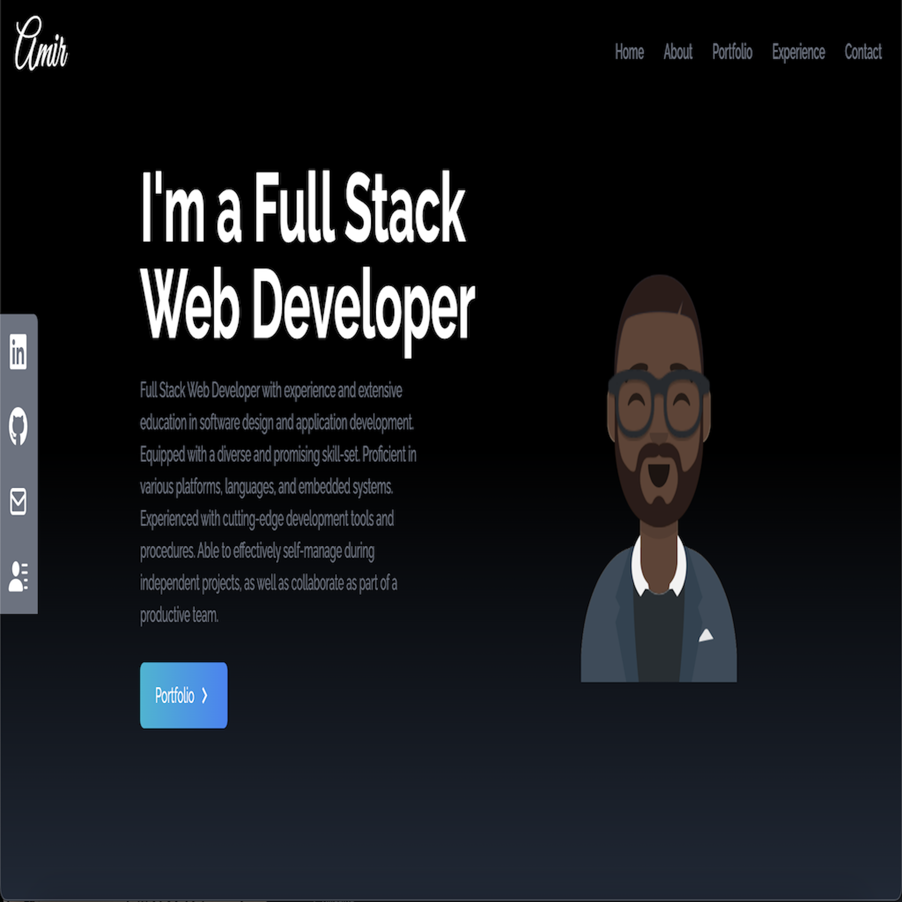

# Amir Hackett React-Portfolio

## Description 
This project is a single-page application using React.js to dynamically render content to create a portfolio that includes "About me", "Contact me", "Resume", and "Portfolio" pages. Take a look at my work through my portfolio page and get to know me a little bit! Download my resume to view my work experience and where to find me.

## Table of Contents
* [Usage](#usage)

## Usage 
This application will allow users view an about me page, send information through a contact form, view my projects, and view my resume. 
Please view deployed application on [Git Hub Pages](https://amir-hackett.github.io/react-portfolio/) 

## Contributing 
Contributors should read the installation section. 

## Tests
There are no tests for this application. 

## Questions
If you have any questions about this projects, please contact me directly at nicole.elisaw@gmail.com. You can view more of my projects at https://github.com/nicolewallace09.